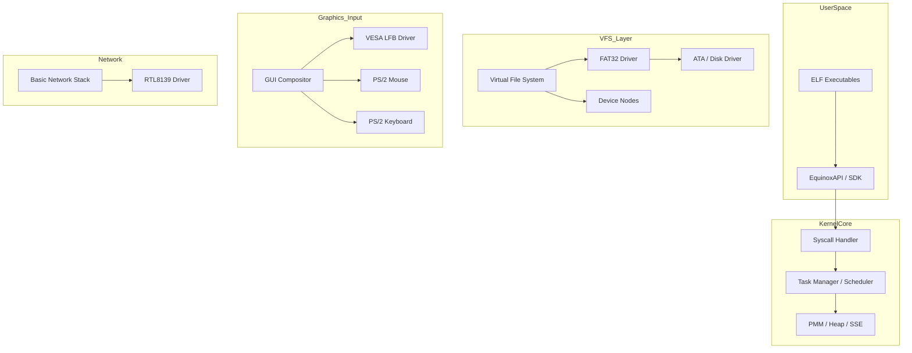

# EquinoxOS: x86_64 Technical Specification & OS Map

<div align="center">

[](LICENSE)
[]()
[]()
[]()

**EquinoxOS** is a hobby monolithic kernel operating system featuring a full graphical user interface, preemptive multitasking, and a custom API for user applications (ELF).

</div>

---

## 🏗 System Architecture

Visualizing data flow and control within the kernel:



---

## 🛠 Hardware Support & Features

| Category | Component | Status | Description |
| :--- | :--- | :--- | :--- |
| **Boot** | Limine Protocol | ✅ | Boots in 64-bit mode, retrieves Memory Map and HHDM. |
| **CPU** | x86_64 / SSE | ✅ | SSE initialization for floating-point operations (used in GUI). |
| **Memory** | PMM + Heap | ✅ | Physical page allocator and kernel heap (malloc/kfree). |
| **Multitasking** | Preemptive | ✅ | Round-Robin scheduler. Context switching via IRQ0 timer. |
| **Graphics** | VESA LFB | ✅ | Direct framebuffer access with hardware cursor and double buffering. |
| **Storage** | FAT32 / ATA | ✅ | File Read/Write support. 8.3 filename compliance. |
| **Network** | RTL8139 | 🛠 | Basic PCI driver, raw packet RX/TX (WIP). |

---

## 🖥 User Interface & Built-in Apps

The OS comes with a graphical shell and a set of system utilities:

1.  **Terminal:** Supports command history and system logging.
2.  **Explorer:** Graphical file manager. Reads FAT32 content and launches executables.
3.  **Notepad:** Text editor with the ability to save (`NOTES.TXT`) to disk.
4.  **Paint:** Graphics editor. **Killer feature:** Canvas export to a valid `.BMP` file on disk.
5.  **System Monitor:** Real-time RAM usage monitoring.

---

## ⌨️ Developer API (EquinoxAPI)

To develop applications for EquinoxOS, the `api.h` is used. Key capabilities:

```c
typedef struct {
    void (*draw_buffer)(int x, int y, int w, int h, uint32_t *buffer);
    uint8_t (*get_scancode)();
    uint32_t (*get_time_ms)();
    void (*print)(const char *str);
} EquinoxAPI;
```
*Applications are loaded as ELF modules via `Limine` or executed through the `Explorer`.*

---

## 📂 Project Structure

```text
├── app/               # Userspace application sources (Snake, BMPView)
├── iso_root/          # Bootable image root (configs, fonts, binaries)
├── sdk/               # Libraries for Equinox development (CRT0, Syscalls)
├── src/               
│   ├── boot/          # Boot protocols (Limine)
│   ├── drivers/       # Hardware drivers (Video, Net, Disk, Input)
│   ├── fs/            # VFS, FAT32 implementation, and ELF Loader
│   ├── gui/           # Window manager and compositor
│   ├── libc/          # Minimal standard library (string, stdio)
│   ├── shell/         # Command line interpreter
│   └── system/        # Kernel Core (GDT, IDT, PMM, Scheduler, Syscalls)
└── Makefile           # Build system (GCC / NASM)
```

---

## 🚀 Quick Start

### Prerequisites
*   `gcc-x86_64-elf` (Cross-compiler)
*   `nasm`
*   `make`, `mtools`, `xorriso`
*   `qemu-system-x86_64`

### Build and Run
```bash
# Compile kernel and create ISO
make build
make iso

# Launch in QEMU with diagnostic flags
make run
```

### Debugging
If the kernel panics, use `addr2line` to locate the fault:
```bash
x86_64-elf-addr2line -e kernel.elf <RIP_ADDRESS>
```

---

## 🗺 Roadmap
- [x] Preemptive Multitasking
- [x] Windowed GUI Support
- [x] FAT32 File System (Read/Write)
- [ ] Stable TCP/IP Stack
- [ ] Port SDK to full Dynamic Linking
- [ ] Port Doom (The ultimate goal)

***

### Contributors
* **@ewasion137** — Lead Developer
* **@oxtiskz** — Special Thanks


