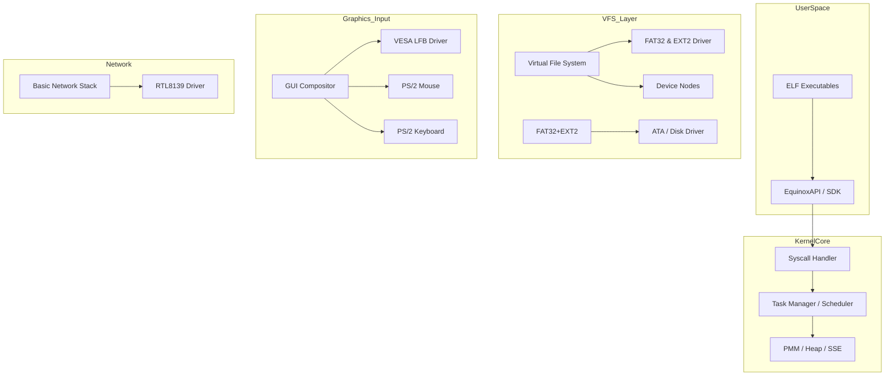

# EquinoxOS: x86_64 Technical Specification & OS Map

<div align="center">

[](LICENSE)
[]()
[]()
[]()

**EquinoxOS** is a hobby monolithic kernel operating system featuring a full graphical user interface, preemptive multitasking, and a custom API for user applications (ELF).
**EquinosOS** is made to be minimally daily usable, and still is in active development.

</div>

---

## 🏗 System Architecture

Visualizing data flow and control within the kernel:



---

## 🛠 Hardware Support & Features

| Category | Component | Status | Description |
| :--- | :--- | :--- | :--- |
| **Boot** | Limine Protocol | ✅ | Boots in 64-bit mode, retrieves Memory Map and HHDM. |
| **CPU** | x86_64 / SSE | ✅ | SSE initialization for floating-point operations (used in GUI). |
| **Memory** | PMM + Heap | ✅ | Physical page allocator and kernel heap (malloc/kfree). |
| **Multitasking** | Preemptive | ✅ | Round-Robin scheduler. Context switching via IRQ0 timer. |
| **Graphics** | VESA LFB | ✅ | Direct framebuffer access with hardware cursor and double buffering. |
| **Storage** | FAT32 / ATA / EXT2 | ✅ | File Read/Write support. 8.3 filename compliance. |
| **Network** | RTL8139 | 🛠 | Basic PCI driver, raw packet RX/TX (WIP). |

---

## 🖥 User Interface & Built-in Apps

The OS comes with a graphical shell and a set of system utilities:

1.  **Terminal:** Supports command history and system logging.
2.  **Explorer:** Graphical file manager. Reads FAT32 content and launches executables.
3.  **Notepad:** Text editor with the ability to save (`NOTES.TXT`) to disk.
4.  **Paint:** Graphics editor. **Killer feature:** Canvas export to a valid `.BMP` file on disk.
5.  **System Monitor:** Real-time RAM usage monitoring.
6.  +**HTML Viewer** and a music player (NiPlay) as external apps!

---

## ⌨️ Developer API (EquinoxAPI)

To develop applications for EquinoxOS, the `api.h` is used. Key capabilities:

```c
typedef struct {
    void (*draw_buffer)(int x, int y, int w, int h, uint32_t *buffer);
    uint8_t (*get_scancode)();
    uint32_t (*get_time_ms)();
    void (*print)(const char *str);
} EquinoxAPI;
```
*Applications are loaded as ELF modules via `Limine` or executed through the `Explorer`.*

---

## 📂 Project Structure

```text
├── app/               # Userspace application sources (Snake, BMPView)
├── iso_root/          # Bootable image root (configs, fonts, binaries)
├── sdk/               # Libraries for Equinox development (CRT0, Syscalls)
├── src/               
│   ├── boot/          # Boot protocols (Limine)
│   ├── drivers/       # Hardware drivers (Video, Net, Disk, Input)
│   ├── fs/            # VFS, FAT32 implementation, and ELF Loader
│   ├── gui/           # Window manager and compositor
│   ├── libc/          # Minimal standard library (string, stdio)
│   ├── shell/         # Command line interpreter
│   └── system/        # Kernel Core (GDT, IDT, PMM, Scheduler, Syscalls)
└── Makefile           # Build system (GCC / NASM)
```

---

## 🚀 Quick Start

### Prerequisites
*   `gcc-x86_64-elf` (Cross-compiler)
*   `nasm`
*   `make`, `mtools`, `xorriso`
*   `qemu-system-x86_64`

### Build and Run
```bash
# Compile kernel and create ISO
make build
make iso

# Launch in QEMU with diagnostic flags
make run
```

### Debugging
If the kernel panics, use `addr2line` to locate the fault:
```bash
x86_64-elf-addr2line -e kernel.elf <RIP_ADDRESS>
```

---

## 🗺 Roadmap
~~1. Paint saving BMP~~
~~2. BMP viewer external application~~
~~3. Ring 3~~
~~4. Z view (Program behind other programs)~~
~~5. Context Switch + Keyboard ARE NOT HARDLOCKED~~
~~6. Better SDK~~
~~7. *PHYSICAL OS*~~
~~8. Doom~~
9. Run on real hardware
~~10. ***SOUND***~~
11. ***USB***
~~12. Port any new FS (EXT2)~~
13. Make your OWN FS
14. Port any SECOND FS (EXT3/EXT4/UFS/ZFS)
15. Make OS SERIOUS (Fix ANY of the stubs | Polishing)
16. Port any language (AS USERSPACE) - C#, C++, Lua, Python [Better to now implement HTML, JS, CSS (Because htmlview.elf)]
16.1. If needed, write SOMETHING IN THE KERNEL on the language implemented (Like UI on lua)
17. Text browser (Maybe will be deleted soon bcs of htmlview.elf)
18. HTTPS 
19 - VERY…
~~19.1 - Very better VESA | Maybe OWN graphical?~~
~~19.2 - Very better Memory~~
~~19.3 - Very better EID (Equinox Interface Designer)~~
19.4. OS is INSTALLABLE/Archiveable so it’s able to separate
19.5 - General separation. Kernel is separated from anything including GUI (except Drivers). 


***

### Contributors
* **@ewasion137** — Lead Developer
* **@oxtiskz** — Special Thanks (Deleted account)
* **@gobgolaxi** - Special thanks (Contributor)
* **@Offihito** - Special thanks (Contributor)
* **@Lertov2424232** - Special thanks (Contributor)


